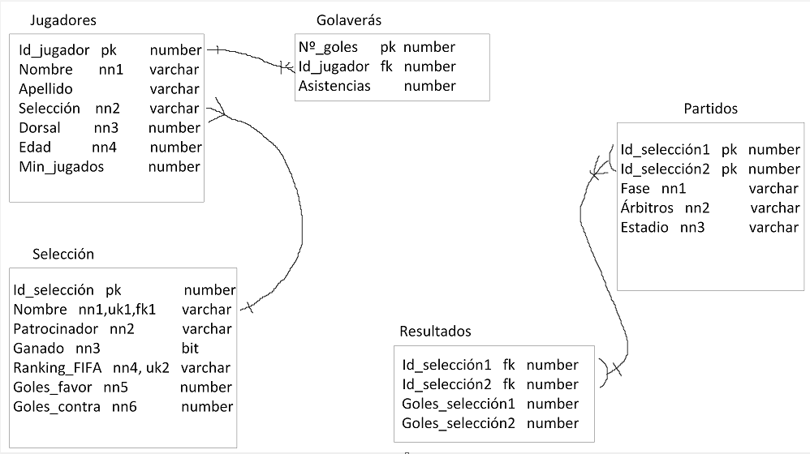

# Proyecto 2 mundial de qatar

## Instalacion

Paso previo a la instalación

.png) 

Elección del tipo de herramienta que utilizaremos

.png)

Instalación de los distintos paquetes 

.png)

Configuración

.png)

Red que utilizaremos 

.png)

Método de autetificación

.png)

Usuarios y contraseñas

.png)

La contraseña de root es la siguiente: 9629b28d613a1d88bd9f9092c1c87601

Configuración de Windows

.png)

Permisos 

.png)

Aplicar la configuración

.png)
.png)

Configuración del producto

.png)

Configuración del servidor

.png)

Conexión al servidor

.png)
.png)

Aplicar la configuración

.png)
.png)   

## Diseño

## Conexion 

## Conclusiones

Durante el transcurso de esta práctica nos hemos encontrado con algunas dificultades que han hecho que el proyecto se nos hiciera menos ameno, la primera y más importante es que la conexión con MySQL, que nos dio varios dolores de cabeza en su momento, ya que no sabíamos muy bien como hacerlo, otro problema nos surgió a la hora de hacer las tablas, ya que en el mundial, hay jugadores con apellidos que pueden hacer que la base de datos no funcione correctamente debido a guiones entre el nombre y el apellido, el nombre estaba compuesto por dos palabras...
Pero al fin de al cabo, mediante investigación y horas lo supimos sacar, con lo que nos llevamos un buen sabor de boca de este trabajo
