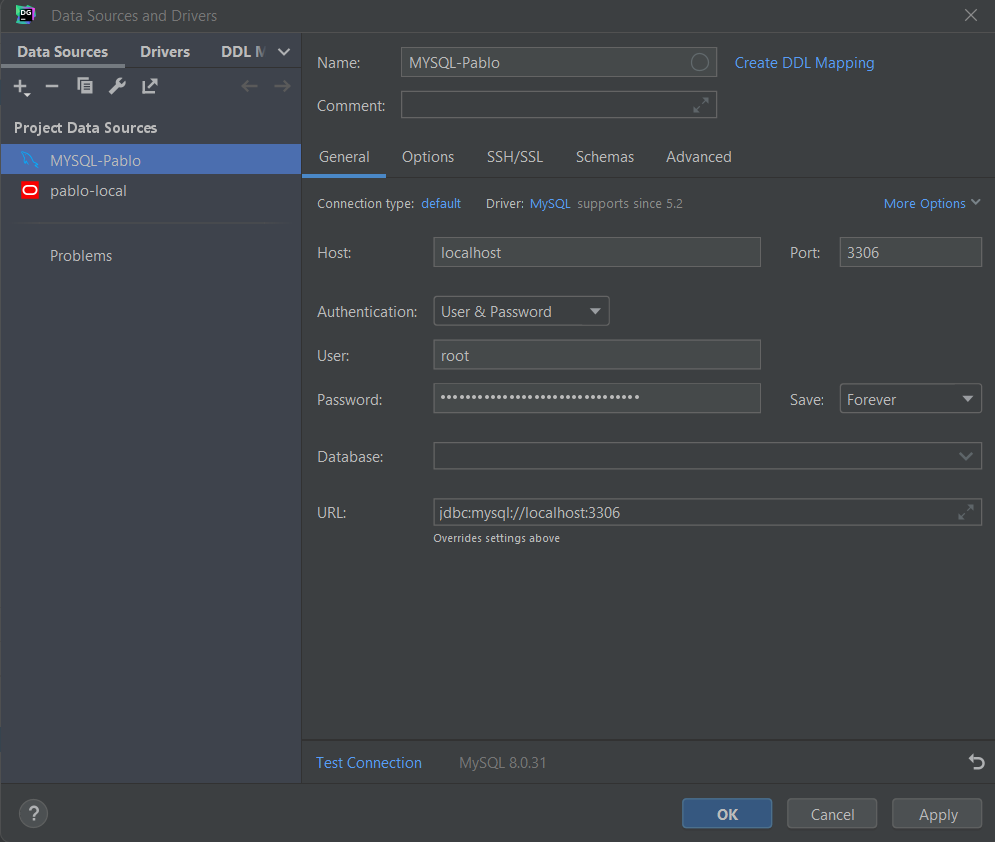

# Proyecto 2 mundial de qatar

## Instalacion
### Pasos Previos
.png)
### Eleccion de Tipo de Herramienta
.png)
### Instalacion de Servicios
.png)
### Configuracion de Productos
.png)
### Red a Utilizar
.png)
### Metodo de Autentificacion
.png)
### Usuarios y Contraseñas
.png)
La contraseña de Root es :9629b28d613a1d88bd9f9092c1c87601
### Configuracion de Windows
.png)
### Permisos
.png)
### Aplicar la Configuracion
.png)
###
.png)
### Configuracion del producto
.png)
### Configuracion del Router
.png)
### Conexion con el servidor
.png)
###
.png)
### Aplicar la Configuracion
.png)
### Instalacion Completada
.png)
## Diseño

## Conexion 

## Conclusiones

Durante el transcurso de esta práctica nos hemos encontrado con algunas dificultades que han hecho que el proyecto se nos hiciera menos ameno, la primera y más importante es que la conexión con MySQL, que nos dio varios dolores de cabeza en su momento, ya que no sabíamos muy bien como hacerlo, otro problema nos surgió a la hora de hacer las tablas, ya que en el mundial, hay jugadores con apellidos que pueden hacer que la base de datos no funcione correctamente debido a guiones entre el nombre y el apellido, el nombre estaba compuesto por dos palabras...
Pero al fin de al cabo, mediante investigación y horas lo supimos sacar, con lo que nos llevamos un buen sabor de boca de este trabajo
